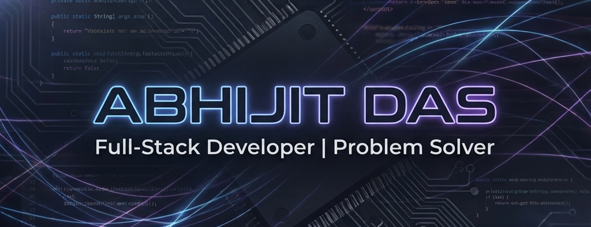

  

  <h1>Hey there! I'm <a href="https://iam-abhijit.github.io/abhijit/" target="_blank">Abhijit Das</a> 👋</h1>
  

    <strong>A Passionate Full-Stack Developer and Tech Enthusiast from India 🇮🇳</strong>
  

  

    
    
    
  

---

### 🚀 About Me

- 🔭 I’m currently building **ServiceMitra** - a platform where all services are at your doorstep.
- 🌱 I am currently exploring **application and software development**.
- 💻 I love turning complex problems into simple, beautiful, and intuitive designs.
- ⚡ Fun fact: I believe code is like poetry; it should be clean, efficient, and meaningful.

---

### 🛠️ Languages & Technologies

  
<b>Frontend Development</b>

  

    
    
    
    
    
    
    
  

  
<b>Backend & Development</b>

  

    
    
    
    
    
    
  

  
<b>Databases & Cloud</b>

  

    
    
    
    
  

  
<b>Design & Tools</b>

  

    
    
    
    
    
  

---

### 📊 GitHub Analysis

  
  

  

---

### 🏆 Achievements & Contributions

  

  

  <h3>🐍 Snake Animation</h3>
  

---

### ✍️ Latest Blog Posts
<!-- BLOG-POST-LIST:START -->
*Stay tuned for updates!*
<!-- BLOG-POST-LIST:END -->

---

### ❤️ Support My Work

  

  

